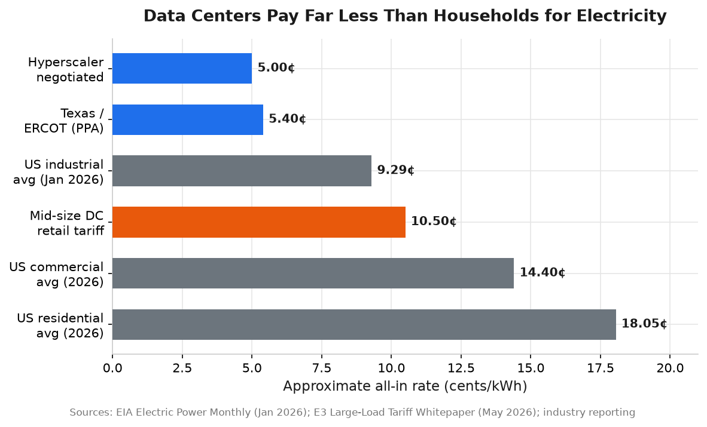
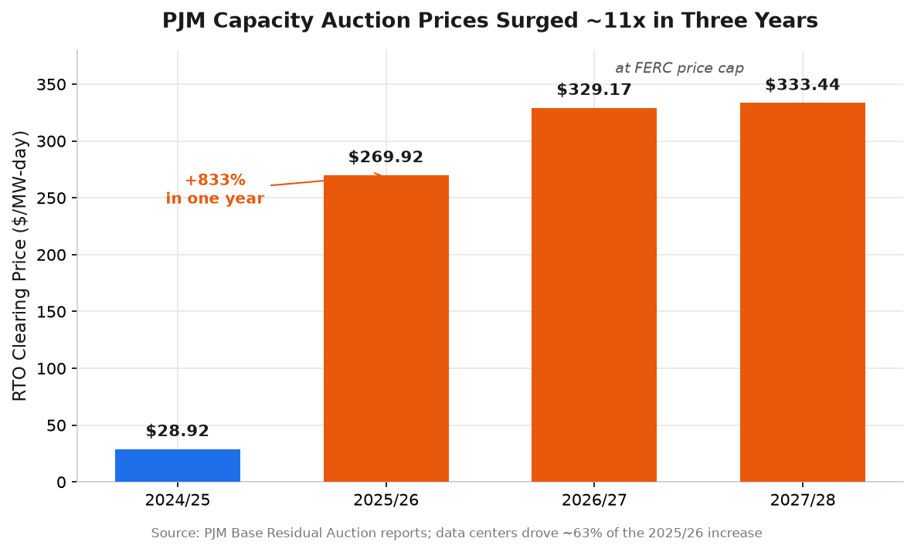

# Electricity Rates for AI Data Centers in the United States

*A 2026 market report on what AI data centers pay for power, how those rates are structured, where they vary, and how the AI buildout is reshaping electricity prices for everyone.*

## Executive Summary

AI data centers occupy a unique position in the US electricity market: they are simultaneously the cheapest large customers per kilowatt-hour and the single biggest force pushing prices up for everyone else. Hyperscalers negotiate all-in rates of roughly **3–7 cents per kWh** — less than half the **18.05 cent** national residential average — yet their explosive demand growth is the primary driver behind an **833% one-year jump in PJM capacity auction prices** and an estimated **$9.3 billion** in added costs across the largest US grid ([Monitoring Analytics](https://www.monitoringanalytics.com/reports/reports/2025/IMM_Analysis_of_the_20252026_RPM_Base_Residual_Auction_Part_G_20250603_Revised.pdf); [PolitiFact](https://www.politifact.com/factchecks/2026/jun/12/elizabeth-warren/data-centers-rising-electricity-costs/)).

That tension defines the entire policy and pricing landscape in 2026. At least **25 utilities across 19 states** have now created dedicated "large-load" rate classes designed to make data centers pay their own way, with minimum-demand obligations averaging **79% of contracted capacity**, contract terms of **10–30 years**, and large upfront collateral requirements ([Terms of Power](https://44409563.fs1.hubspotusercontent-na1.net/hubfs/44409563/Terms%20of%20Power_White%20Paper_260316.pdf); [LBNL](https://eta-publications.lbl.gov/sites/default/files/2025-01/electricity_rate_designs_for_large_loads_evolving_practices_and_opportunities_final.pdf)). Meanwhile, FERC, the White House, Congress, and 23 state legislatures are racing to write rules ensuring "cost-causers pay."

The result is a bifurcating market: constrained legacy hubs like Northern Virginia, where industrial rates jumped **29% in a single year**, versus power-rich, faster-to-interconnect markets in Texas and the Midwest that are winning the next wave of AI deployments.

## How Much Do AI Data Centers Actually Pay?

The headline reality is that large data centers do not pay retail rates. The US market is sharply stratified by customer class and negotiating power.

| Customer Class / Deal Type | Approx. All-In Rate (¢/kWh) | Notes |
|---|---|---|
| Hyperscaler negotiated wholesale/special rate | **3–7** | Google–Dominion deal reported at ~6¢ ([Washington Post via Protect PWC](https://protectpwc.org/2024/11/01/washington-post-as-data-centers-for-ai-strain-the-power-grid-bills-rise-for-everyday-customers/)) |
| West Texas (ERCOT), blended PPA supply | 4.5–5.8 | Cheapest US market for large data centers ([Jaken Energy](https://jakenenergy.com/article-117-data-center-power-procurement.html)) |
| Pacific Northwest (hydro-dominated) | ~4.2 | Low-cost hydro; transmission constrained |
| US industrial average (Jan. 2026) | 9.29 | Includes demand charges, T&D ([EIA](https://www.eia.gov/electricity/monthly/epm_table_grapher.php?t=table_5_03)) |
| Mid-sized data center on retail tariff | 9–12 | E.g., Chicago, Atlanta |
| US commercial average (2026) | ~14.4 | ([EIA](https://www.eia.gov/electricity/monthly/update/end-use.php)) |
| US residential average (2026) | 18.05 | Up ~21% in five years ([ElectricChoice](https://www.electricchoice.com/electricity-prices-by-state/historical/)) |

The most-cited benchmark is the **Google–Dominion arrangement in Virginia at roughly 6 cents/kWh** — less than half the residential rate — which prompted scrutiny from other ratepayers paying considerably more ([Washington Post via Protect PWC](https://protectpwc.org/2024/11/01/washington-post-as-data-centers-for-ai-strain-the-power-grid-bills-rise-for-everyday-customers/)).

A useful apples-to-apples reference comes from consulting firm E3, which modeled a representative **100 MW data center at 95% load factor** under five major utility tariffs ([E3 Large-Load Tariff Whitepaper](https://www.ethree.com/wp-content/uploads/2026/05/E3_Large-Load-Tariff-Whitepaper-1.pdf)):

| Utility / Tariff | All-In (¢/kWh) | Demand Charge ($/kW-yr) | Energy (¢/kWh) |
|---|---|---|---|
| Oncor (Texas, ERCOT supply separate) | 5.44 | $5.75 (T&D only) | 6.67 |
| Dominion VA – GS-4 (current standard) | 6.54 | $140 | 3.26 |
| Dominion VA – GS-5 (effective Jan. 2027) | 7.96 | $244 | 3.36 |
| ComEd (Illinois) | 8.86 | $383 | 2.91 |
| Georgia Power – PLL-18 (no demand charge) | 9.43 | $0 | 9.43 |

## Anatomy of a Data Center Power Bill

The single all-in rate masks a complex bill. For large industrial loads, the **demand charge often rivals or exceeds the energy charge** — a 10 MW data center can pay roughly seven times more in demand charges than energy charges in a given month under some tariffs ([arXiv](https://arxiv.org/pdf/1307.5442.pdf)).

- **Energy charge (2.9–9.4¢/kWh):** the variable cost of electricity consumed. In deregulated states (Texas, Illinois, parts of PJM), large customers procure supply separately via competitive providers or PPAs ([E3](https://www.ethree.com/wp-content/uploads/2026/05/E3_Large-Load-Tariff-Whitepaper-1.pdf)).
- **Demand charge ($10–35/kW-month):** based on the highest 15-minute power draw. Most tariffs apply a **demand ratchet** setting minimum billing at 80–90% of the customer's highest recent demand, making this cost essentially fixed. Dominion's GS-4 charge is $140/kW-year; ComEd's reaches $383/kW-year ([E3](https://www.ethree.com/wp-content/uploads/2026/05/E3_Large-Load-Tariff-Whitepaper-1.pdf); [EnergyCAP](https://www.energycap.com/blog/bill-charges/)).
- **Capacity charge (15–25% of bill):** in PJM states, driven by the capacity auction and the customer's Peak Load Contribution (see next section).
- **Transmission charge (1–4¢/kWh):** moving bulk power over high-voltage lines. Virginia anticipates over **$22.4 billion** in forward transmission investment to serve data center load ([Grid Flexibility](https://gridflexibility.fyi/case-studies/dominion-virginia)).
- **Distribution charge (5–15%):** local poles and wires; transmission-connected hyperscalers often bypass this.
- **Riders:** fuel adjustment clauses, renewable portfolio standard charges, and new mechanisms like Portland General Electric's **Peak Growth Modifier**, which allocates growth-related costs to the customer class driving fastest load growth ([Utility Dive](https://www.utilitydive.com/news/oregon-puc-approves-pges-large-load-tariff-framework-for-data-centers/821361/)).

A rough breakdown for a transmission-connected PJM data center: energy 30–50%, capacity 15–25%, transmission 10–20%, distribution 5–15%, riders 5–15%.

## The PJM Capacity Crunch: Where Data Centers Hit the Grid Hardest

Nothing illustrates the data center impact more dramatically than PJM Interconnection — the largest US grid operator, serving 67 million people across 13 states plus DC. PJM's Base Residual Auction secures power-plant commitments three years ahead, and the clearing price flows directly into retail bills.

| Delivery Year | Clearing Price (RTO) | Total Capacity Bill |
|---|---|---|
| 2024/25 | $28.92/MW-day | ~$2.2 billion |
| 2025/26 | $269.92/MW-day (+833%) | $14.7 billion |
| 2026/27 | $329.17/MW-day (FERC cap) | $16.1 billion |
| 2027/28 | $333.44/MW-day (FERC cap) | $16.4 billion |

Sources: [PJM 2025/26 BRA Report](https://www.pjm.com/-/media/DotCom/markets-ops/rpm/rpm-auction-info/2025-2026/2025-2026-base-residual-auction-report.pdf); [PJM 2026/27 BRA Report](https://www.pjm.com/-/media/DotCom/markets-ops/rpm/rpm-auction-info/2026-2027/2026-2027-bra-report.pdf); [PJM Dec. 2025 release](https://www.pjm.com/-/media/DotCom/about-pjm/newsroom/2025-releases/20251217-pjm-auction-procures-134479-mw-of-generation-resources.pdf).

The jump from $28.92 to $269.92/MW-day was the largest in PJM's 27-year history. Both subsequent auctions hit the FERC-approved price cap; without it, PJM's own simulations show 2026/27 would have cleared at **$388.57** and 2027/28 at **$529.80/MW-day** ([IEEFA](https://ieefa.org/resources/projected-data-center-growth-spurs-pjm-capacity-prices-factor-10)). The December 2025 auction was the **first in PJM history to fall short of the reliability requirement**, by 6,623 MW ([PJM 2025 Year in Review](https://insidelines.pjm.com/2025-in-review-pjm-market-rules-support-efficiency-resource-adequacy/)).

PJM's independent market monitor, Monitoring Analytics, delivered the definitive verdict: *"data center load growth is the primary reason for recent and expected capacity market conditions."* Specifically, data centers caused **63% of the 2025/26 price increase — $9.3 billion** — and account for **93–94% of PJM's projected load growth through 2030** ([Monitoring Analytics](https://www.monitoringanalytics.com/reports/reports/2025/IMM_Analysis_of_the_20252026_RPM_Base_Residual_Auction_Part_G_20250603_Revised.pdf)). Wholesale energy prices followed: PJM averaged **$136.53/MWh in Q1 2026, up 76%** year-over-year ([E&E News](https://www.eenews.net/articles/data-centers-drive-76-surge-in-pjm-power-prices/)).

## Regional Differences: Where Data Centers Plug In

National averages hide enormous geographic variation. The industrial rate spread between the cheapest and most expensive states is roughly fivefold — a 500 MW data center running continuously pays about **$43 million more per year** at California rates than in North Dakota ([EIA Table 5.6.A](https://www.eia.gov/electricity/monthly/epm_table_grapher.php?t=epmt_5_6_a)).

| State | Grid/RTO | Industrial Jan. 2026 (¢/kWh) | YoY Change | Primary Utility |
|---|---|---|---|---|
| North Dakota | MISO/SPP | 7.51 | +4% | Basin Electric, Otter Tail |
| Texas | ERCOT | 8.64 | +2% | Oncor, CenterPoint |
| Wyoming | WECC | 9.63 | +2% | Rocky Mountain Power |
| Iowa | MISO | 10.52 | +5% | MidAmerican Energy |
| Oregon | WECC | 10.28 | +1% | PGE, PacifiCorp |
| Arizona | WECC | 11.46 | −3% | APS, SRP |
| **Virginia** | **PJM (DOM)** | **11.43** | **+29%** | **Dominion Energy** |
| Washington | WECC | 11.64 | +14% | Puget Sound Energy |
| Georgia | Southeast | 12.19 | +2% | Georgia Power |
| Illinois | PJM | 12.28 | +4% | ComEd |
| Tennessee | TVA | 12.97 | +2% | Tennessee Valley Authority |
| Ohio | PJM | 13.12 | +23% | AEP Ohio |

Source: [EIA Table 5.6.A](https://www.eia.gov/electricity/monthly/epm_table_grapher.php?t=epmt_5_6_a) (January figures reflect winter peaks; full-year averages run lower). The most expensive states for industrial power — Hawaii (37.35¢), Massachusetts (25.64¢), Connecticut (23.16¢), California (23.13¢), and New York (22.28¢) — are effectively off-limits for cost-sensitive AI workloads.

### The RTO Picture

Wholesale market structure matters as much as retail rates. ERCOT runs **no capacity auction**, which is the single biggest reason Texas rates have stayed low even amid surging demand ([Reuters](https://www.reuters.com/business/energy/soaring-us-power-auction-prices-set-spur-new-projects--reeii-2025-09-09/)).

| RTO/Hub | 2024 Annual Avg ($/MWh) | Data Center Capacity Market |
|---|---|---|
| SPP | $27.87 | None (lowest national prices) |
| Southeast (SoCo) | $29.72 | Vertically integrated, no RTO auction |
| ERCOT | ~$35 | No capacity auction; storm-volatile |
| MISO | ~$40–45 | $384–666/MW-day seasonal auctions |
| PJM | ~$45–55 | $269–333/MW-day (capped); crisis-level |

Source: [FERC State of the Market 2024](https://www.ferc.gov/sites/default/files/2025-03/25_State-of-the-Market_0320_1200.pdf); [Integrity Energy Q1 2026](https://www.integrityenergy.com/wp-content/uploads/2026/05/IE-News-Q1-2026-Energy-Market-Recap.pdf).

### Major Hubs and Why They Were Chosen

- **Northern Virginia ("Data Center Alley"):** The world's largest concentration — Loudoun County alone holds ~25% of US capacity. Originally chosen for dense fiber/internet-exchange peering, federal proximity, and historically cheap power. Now severely constrained: Dominion's large-load request queue has hit **~70 GW — nearly triple the system's all-time peak demand** — and interconnection waits stretch 5–8+ years. Loudoun ended "by-right" data center zoning in 2025 ([Protect PWC](https://protectpwc.org/2026/02/11/breaking-news-dominion-discloses-tripling-of-data-center-load-demand/); [DLA Piper](https://www.dlapiper.com/en/insights/publications/2025/03/recent-legislative-and-local-actions-affecting-data-center-development-in-virginia)).
- **Dallas / Texas (ERCOT):** #2 nationally, ~342 data centers drawing ~7.6 GW. Low rates, no capacity market, no state income tax, sales-tax exemptions, abundant land, and **20-month interconnection** (vs. 40 months in PJM) ([Carbon Direct](https://www.carbon-direct.com/press/carbon-direct-releases-new-analysis-of-power-grid-interconnection-queues-pjm-ercot)).
- **Phoenix, Arizona:** Now North America's largest market by some metrics, drawing California overflow. Tax exemptions through 2033, low land costs, minimal disaster risk — though APS has proposed a **47% rate increase for extra-large users** ([CBRE](https://www.cbre.com/insights/books/north-america-data-center-trends-h2-2025/phoenix-data-center-market)).
- **Atlanta, Georgia:** Low ~7¢ industrial rates, a base-rate freeze through 2028, and PSC approval of **9,985 MW of new generation** (~80% for data centers). Data centers must fund their own infrastructure upfront ([Georgia PSC](https://psc.ga.gov/site/downloads/datacenterfactsheet.pdf)).
- **Columbus, Ohio:** Absorbing displaced Virginia projects thanks to PJM's 765 kV transmission backbone and shovel-ready land, despite a new data center tariff and rates up 16% since 2023 ([CNBC](https://www.cnbc.com/2025/11/14/data-centers-are-concentrated-in-these-states-heres-whats-happening-to-electricity-prices-.html)).
- **Iowa:** ~$20B+ from Google, Microsoft, Meta, and Apple, drawn by **63% wind generation** (highest in the US) and MidAmerican's 100% renewable matching at ~6¢/kWh ([MMCG Invest](https://www.mmcginvest.com/feasibility-study-iowa)).

## The New "Large-Load" Rate Classes

The defining regulatory development of 2025–2026 is the rapid creation of data-center-specific tariffs. As of June 2026, **25 utilities across 19 states** have filed them, with an average minimum ratchet of **79%** of contracted capacity and contract terms jumping from the historical 1–5 years to 10–30 years ([Terms of Power](https://44409563.fs1.hubspotusercontent-na1.net/hubfs/44409563/Terms%20of%20Power_White%20Paper_260316.pdf)).

| Utility | State | Effective | Threshold | Min. Demand | Term |
|---|---|---|---|---|---|
| Dominion – GS-5 | Virginia | Jan. 2027 | ≥25 MW + 75% LF | 85% T&D; 60% gen | 14 yrs |
| AEP Ohio – DCT | Ohio | Jul. 2025 | ≥25 MW | 85% (sliding) | 12 yrs |
| Indiana Michigan Power | Indiana | Feb. 2025 | ≥70 MW | 80% | 12 yrs |
| PGE – Schedule 96 | Oregon | Jun. 2026 | ≥20 MW | 90% | 10–30 yrs |
| Georgia Power (custom) | Georgia | Feb. 2025 | ≥100 MW | Contract min. | 15 yrs |
| Consumers Energy | Michigan | Nov. 2025 | ≥100 MW | 80% | 15 yrs |
| Ameren Missouri | Missouri | Jan. 2026 | ≥75 MW | 80% | 12 yrs |

Sources: [LBNL](https://eta-publications.lbl.gov/sites/default/files/2025-01/electricity_rate_designs_for_large_loads_evolving_practices_and_opportunities_final.pdf); [EEI Large Load tracker](https://www.eei.org/-/media/Project/EEI/Documents/Issues%20and%20Policy/List%20of%20Large%20Customer%20Projects%20and%20Tariffs); [POWER Magazine](https://www.powermag.com/regulator-approves-aep-ohios-landmark-data-center-tariff/).

Two examples show the bite. **Dominion's GS-5** (effective January 2027) requires a 14-year contract, payment of **85% of transmission/distribution demand and 60% of generation demand** even when idle, collateral up to **$1.5 million per MW**, and three years' notice to reduce load ([Compute Law Blog](https://computelaw.blog/power/dominion-pjm-power-ai-data-centers-virginia/); [Cardinal News](https://cardinalnews.org/2025/11/26/regulators-approve-dominion-energy-rate-increase/)). **Oregon's Schedule 96** adds a **1 cent/kWh surcharge on usage above 100 MW** that funds low-income energy programs, and requires data centers to pay 100% of distribution upgrade costs ([Utility Dive](https://www.utilitydive.com/news/oregon-puc-approves-pges-large-load-tariff-framework-for-data-centers/821361/)).

## Bypassing the Grid: PPAs and "Bring Your Own Power"

Faced with multi-year interconnection queues and record capacity prices, developers increasingly procure dedicated generation. Roughly **101 GW of behind-the-meter natural gas capacity** has been announced, with Texas leading at ~38 GW in development ([RBC Capital Markets](https://www.rbccm.com/en/insights/2026/05/natural-gas-powers-the-data-center-boom)).

**Nuclear PPAs** offer 20-year price certainty at a premium of roughly 2–2.5x spot wholesale:

- **Microsoft–Constellation (Three Mile Island):** 20-year, 835 MW deal to restart the reactor by 2028; estimated **$100–115/MWh** ([Reuters](https://www.reuters.com/markets/deals/microsoft-may-pay-constellation-premium-three-mile-island-power-agreement-2024-09-23/); [Utility Dive](https://www.utilitydive.com/news/constellation-three-mile-island-nuclear-power-plant-microsoft-data-center-ppa/727652/)).
- **Amazon–Talen (Susquehanna):** After FERC twice rejected a behind-the-meter structure, the deal was restructured to grid-connected — a **17-year, $18 billion PPA for up to 1,920 MW** through 2042, with AWS paying all T&D charges as a retail customer ([POWER Magazine](https://www.powermag.com/talen-amazon-launch-18b-nuclear-ppa-a-grid-connected-ipp-model-for-the-data-center-era/)).
- Others include **Google–Kairos** (500 MW SMR, ~$115/MWh) and **Oracle's** 1 GW nuclear PPA ([NuclearPPA.com](https://nuclearppa.com)).

**On-site gas turbines** are the dominant near-term option, with LCOE of **$0.045–0.075/kWh** — but face 24+ month turbine lead times and capital costs up 66% since 2023. Notable projects include Homer City (4.4 GW combined-cycle, Pennsylvania), xAI's Colossus (1.2 GW, Mississippi), and Oracle/VoltaGrid (2.3 GW, Texas) ([RBC](https://www.rbccm.com/en/insights/2026/05/natural-gas-powers-the-data-center-boom); [Data Center Frontier](https://www.datacenterfrontier.com/energy/article/55368331/byop-moves-to-the-center-of-data-center-strategy)). FERC's rejection of the Talen/Amazon behind-the-meter expansion signals active scrutiny of arrangements that let large loads avoid grid cost obligations.

## Who Really Pays? The Ratepayer Debate

Whether data centers are raising household bills is genuinely contested — and the answer is "partly, unevenly, and depending on the grid."

The viral claim that bills "went up by as much as 267%" was rated **Mostly False** by PolitiFact. The 267% figure comes from a Bloomberg analysis of **wholesale prices at specific grid nodes**, not household bills; wholesale supply is only **30–50%** of a typical residential bill ([PolitiFact](https://www.politifact.com/factchecks/2026/jun/12/elizabeth-warren/data-centers-rising-electricity-costs/); [Bloomberg](https://www.bloomberg.com/graphics/2025-ai-data-centers-electricity-prices/)). Actual five-year residential increases through early 2026 were +94% in DC, +74% in Maryland, +73% in Maine, and +42% nationally — significant, but driven by multiple factors ([PolitiFact](https://www.politifact.com/factchecks/2026/jun/12/elizabeth-warren/data-centers-rising-electricity-costs/)).

Three nuances matter:

1. **Inside PJM, the causal link is strong.** Documented capacity-driven household increases include **$21/month** for DC's Pepco customers, **$17/month** for Baltimore's BGE, and **$16/month** in Ohio. NRDC projects **+$70/month per PJM household by 2028** and **$100–163 billion cumulative through 2033** ([IEEFA](https://ieefa.org/resources/projected-data-center-growth-spurs-pjm-capacity-prices-factor-10); [NRDC](https://www.nrdc.org/sites/default/files/2025-09/Ensuring_Energy_Affordability_Reliability_with_Data_Center_Demand_1.pdf)).
2. **Outside PJM, the link weakens.** An Institute for Energy Research study found **no statistically significant relationship** between data center count and state electricity prices; top-10 data center states averaged 14.46¢/kWh versus 14.39¢ everywhere else ([Daily Economy/IER](https://thedailyeconomy.org/article/data-center-panic-gets-electricity-prices-wrong/)).
3. **Methodology, not just data centers, drove the PJM spike.** PJM's adoption of a new reliability methodology accounted for roughly **49% ($4.4 billion)** of the 2025/26 auction increase, independent of data center load ([OPC-DC/Synapse](https://opc-dc.gov/wp-content/uploads/2025/05/PJM-Capacity-Market-Report-FINAL-OPC-Synapse.pdf)).

There is also a counterargument that, properly charged, data centers can **lower** average rates by spreading fixed grid costs across more kWh ([LBNL](https://eta-publications.lbl.gov/sites/default/files/2024-12/lbnl-2024-united-states-data-center-energy-usage-report_1.pdf)).

## The Scale of Demand Driving It All

US data center electricity use has nearly tripled — from **58 TWh in 2014 to ~183 TWh in 2024**, about **4.4% of national consumption** — and the Lawrence Berkeley National Lab projects **325–580 TWh by 2028 (6.7%–12% of US electricity)** ([LBNL](https://newscenter.lbl.gov/2025/01/15/berkeley-lab-report-evaluates-increase-in-electricity-demand-from-data-centers/)). The IEA expects data centers to drive nearly **half of all US electricity demand growth** through 2030, and the EIA projects record national demand of **4,283 billion kWh in 2026** ([IEA via S&P Global](https://www.spglobal.com/energy/en/news-research/latest-news/electric-power/041025-global-data-center-power-demand-to-double-by-2030-on-ai-surge-iea); [EIA](https://www.eia.gov/todayinenergy/detail.php?id=67704)). New data center demand is being added at 5–7 GW/year while new generation comes online at only 2–3 GW/year — the core mismatch behind rising prices.

## Policy Response: "Cost-Causers Pay"

The backlash has been bipartisan and multi-level, converging on a single principle: those who cause grid costs should bear them.

- **Federal:** The bipartisan **GRID Act** (Hawley/Blumenthal, Feb. 2026) would require new ≥20 MW data centers to source off-grid power; the **Power for the People Act** (Van Hollen/Warner) directs FERC to require data centers to pay for transmission upgrades; and a Warren-led investigation has demanded data from major hyperscalers ([Hawley](https://www.hawley.senate.gov/hawley-blumenthal-introduce-bill-to-prevent-data-centers-from-increasing-electricity-costs-for-americans/); [Warner](https://www.warner.senate.gov/newsroom/press-releases/warner-sponsors-bill-to-ensure-virginians-arent-stuck-footing-the-bill-for-big-data-centers/)).
- **White House:** A March 2026 **Ratepayer Protection Pledge** — signed by Google, Microsoft, Meta, Amazon, Oracle, xAI, and OpenAI — commits signatories to fund their own generation and infrastructure, though it is non-binding ([White House](https://www.whitehouse.gov/releases/2026/03/ratepayer-protection-pledge/)).
- **FERC (RM26-4-000):** Acting by end of June 2026, FERC proposes a 20 MW interconnection threshold, **100% cost assignment** for triggered network upgrades, readiness deposits, and co-location rules requiring data centers to pay for actual grid net withdrawals ([Holland & Knight](https://www.hklaw.com/en/insights/publications/2026/04/ferc-to-act-on-large-load-interconnection-docket-in-june); [Baker Botts](https://www.bakerbotts.com/thought-leadership/publications/2025/december/ferc-issues-order-providing-guidance-for-co-locating-power-plants-with-data-centers-within-pjm)).
- **States:** **23 states** have approved at least one large-load tariff, with 7 more pending and 238+ data center bills introduced in 2025. Oregon's POWER Act, Virginia's GS-5, Minnesota's HF 16, and New Jersey legislation all create dedicated cost-responsibility classes ([EEI](https://www.eei.org/-/media/Project/EEI/Documents/Issues%20and%20Policy/List%20of%20Large%20Customer%20Projects%20and%20Tariffs)).

## Outlook

The US data center power market in 2026 is defined by a structural split. **Constrained legacy hubs** — Northern Virginia, the Bay Area, parts of Chicago — remain the largest operating clusters but face multi-year interconnection waits, FERC-capped capacity costs, and the steepest retail rate increases in the country. **Power-access markets** — Texas, the Midwest, and the Southeast — are winning new AI deployments by offering the "fastest credible megawatt" rather than merely the cheapest ([Bloom Energy](https://www.bloomenergy.com/wp-content/uploads/2026-power-report.pdf); [Enerdatics](https://natlawreview.com/press-releases/enerdatics-releases-us-data-center-state-market-report-february-2026-mapping)).

For data center developers, the era of cheap, fast, lightly-regulated power is ending. Expect to negotiate 10–30 year contracts with 80–90% take-or-pay obligations, post substantial collateral, and increasingly fund or secure your own generation. For ratepayers and regulators, the open question is whether the wave of new tariffs and the pending FERC rule will arrive fast enough to keep the AI buildout from landing on household bills — a question that has already become a 2026 electoral issue ([CNBC](https://www.cnbc.com/2025/11/12/electricity-prices-data-center-ai-new-jersey-virginia-midterm-election.html)).
